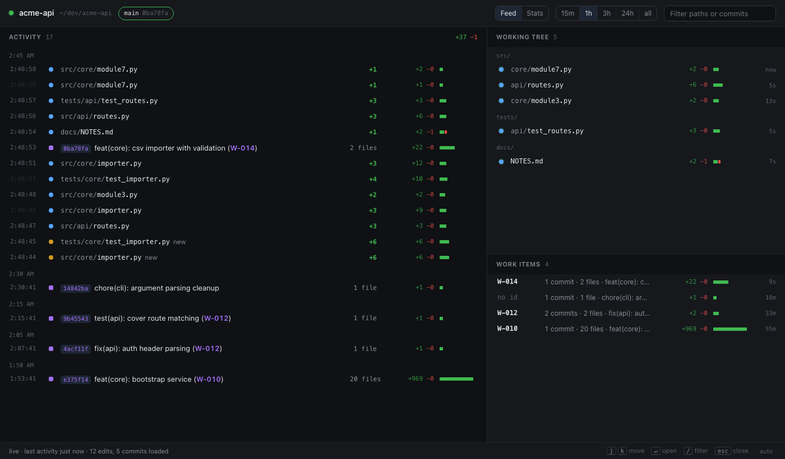
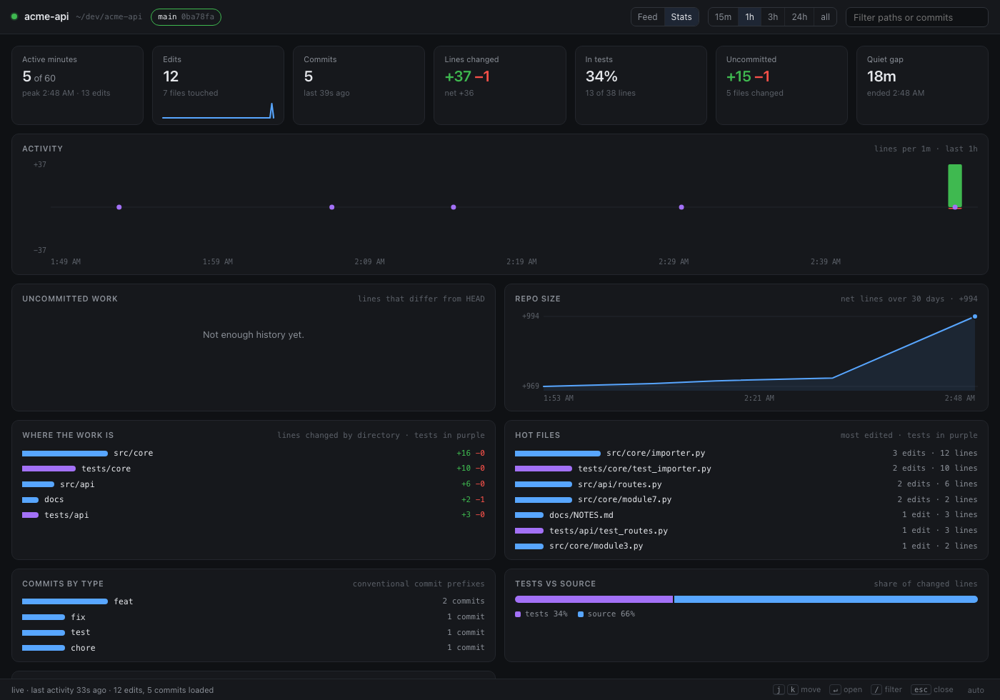
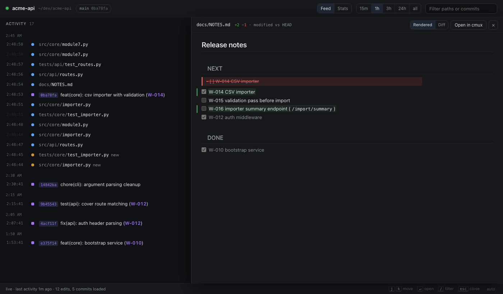

# repo-pulse

**See what is happening to a git repo, as it happens.** Every write becomes a row with its
size. Commits roll up by work item. Click anything for the diff. A stats view shows where the
work is going. Built for watching coding agents work overnight, useful for any repo, any editor,
any agent, no hooks or integration required.

[](https://github.com/wiseyoda/repo-pulse/actions/workflows/ci.yml)
[](LICENSE)
[](https://nodejs.org)




```sh
cd ~/dev/some-repo
repo-pulse
```

That is the whole workflow. It starts in the background, opens the page, and gets out of the
way. Inside [cmux](https://cmux.com) the page opens as a browser tab in the pane you typed the
command in; anywhere else it opens in your default browser.

## Why

Watching an agent edit a repo through `git status` and a file browser tells you what is
different now, not what is happening. repo-pulse answers the questions you actually have while
something is working on your code:

- **Is it doing anything?** The feed ticks with every write, the size of each edit beside it.
- **Where is it working?** The working tree is sorted by last touch; rows fade over fifteen
  minutes, so the busy corners stand out.
- **What did that edit do?** Click the row. Files show the diff against HEAD, commits show the
  full patch, markdown opens rendered with the changes painted on.
- **What is it converging on?** Commits roll up by work item id (`W-014`, `D-43`), so a
  300-commit night reads as twelve items with their size.
- **Is the shape of the work right?** The stats view: lines over time, share of changes landing
  in tests, uncommitted work, churn by directory, hot files, commit types.

It observes only. Git's own ignore rules are the noise filter, git decides what changed, and
the tool never writes into the repository it watches.

## Install

Requires Node 24 or newer and git. There are no runtime dependencies; Node runs the TypeScript
sources directly.

```sh
git clone https://github.com/wiseyoda/repo-pulse
cd repo-pulse
pnpm install
ln -s "$PWD/bin/repo-pulse" ~/.local/bin/repo-pulse   # or anywhere on your PATH
```

## Use

```sh
repo-pulse                 # this repo: start in the background and open the page
repo-pulse ~/dev/other     # a different repo
repo-pulse ps              # every running instance, with viewers and when it stops
repo-pulse --stop          # stop this repo's instance
repo-pulse --stop-all      # stop them all
repo-pulse -f              # run attached to the terminal instead (logs there, Ctrl-C stops it)
```

Running `repo-pulse` again for a repo that already has a feed just opens that feed. A second
repo gets the next free port. Every worktree of a repo is watched by the one instance.

**It cleans up after itself.** An instance stops on its own after two hours with no page
connected and no activity in the repo. It never stops while you are looking at it, and it
keeps going unwatched as long as edits or commits keep arriving. `--idle 6h` changes the
budget; `--idle off` disables it. `repo-pulse ps` shows when each one will stop.

### The page

| Key       | Action                                       |
| --------- | -------------------------------------------- |
| `j` `k`   | Move through the feed (arrow keys work too)  |
| `Enter`   | Open the selected row                        |
| `Esc`     | Close the drawer, then clear the filter      |
| `/`       | Focus the filter (paths and commit subjects) |
| `1` … `5` | Time window: 15m, 1h, 3h, 24h, all           |
| `s`       | Switch between the feed and the stats view   |
| `g`       | Jump to the top of the feed                  |

- Click a **worktree chip** to see only that worktree. Click a **work item** to filter to it.
- While you are scrolled into history, new rows queue behind a pill instead of moving the
  list under you. The tab title shows the count.
- Narrow window? Below 960px the three panels become tabs, so a side pane shows everything.
- Diff lines wrap by default; the `wrap` button turns that off. The drawer's URL (`#file=…`)
  survives a reload.

### Stats



Same window, worktree, and filter as the feed. Everything is derived from git and the edit
log, so it works for any repo:

- **Tiles**: active minutes, edits, commits, lines changed, share of changed lines that landed
  in tests, uncommitted work, longest quiet gap.
- **Activity**: lines added above the line and deleted below, per minute or hour, commits
  marked. When one burst dwarfs the rest, the axis caps at the 95th percentile and says so.
- **Uncommitted work** and **repo size** as trend lines.
- **Where the work is** by directory, **hot files**, **commits by type**, **tests vs source**,
  and the repo's **file mix**.

### LLM usage

An opt-in view (`u`, or `/#usage`) of what the coding agents working in this repo cost. Enable
it once per repo and repo-pulse reads the transcripts on this machine whose working directory
is inside the repo: Claude Code (every `~/.claude*` config dir, subagents included), Codex
(`~/.codex*` rollouts), Grok (`~/.grok` sessions), and Antigravity (per-conversation SQLite databases under `~/.gemini*/antigravity*`, decoded
the way ccusage's adapter does, so models and tokens match it). Only usage and metadata fields are read (tokens, model,
timestamp, working directory, branch), never message content.

- Tiles: API-equivalent cost, tokens, cache hit rate, sessions, cost per commit, cost per 100
  lines changed.
- Cost over time stacked by tool; tokens over time by class (input, cache write, cache read,
  output); breakdowns by model, work item, branch, and account; the latest sessions.
- Counting mirrors each tool's own accounting (ccusage's dedupe rules), and matches ccusage to
  the token on the repos it was checked against.
- Prices come from the public [LiteLLM price file](https://github.com/BerriAI/litellm/blob/main/model_prices_and_context_window.json),
  refreshed daily and cached. They mean what the same tokens would cost on the provider's API,
  not what a subscription charges. Grok reports its own cost, which is used as is. Models the
  file lacks can be priced in `~/.repo-usage/pricing_overrides.json` (USD per million tokens).
- State lives under `~/.repo-usage/<repo>/`, named after the origin remote's repo name:
  `config.json` (enabled, roots, sources), `usage.jsonl`, `scan.json`. Disable from the view or
  by setting `enabled` to false.

### Markdown



Markdown files open rendered. Added lines are highlighted, removed text is struck through
where it sat, and the view scrolls to the first change. The Rendered / Diff toggle switches to
the raw diff and remembers your choice. The renderer is dependency-free and never injects HTML.

## How it works

A recursive filesystem watcher on each worktree triggers a debounced `git diff --numstat`
snapshot. The difference between two snapshots becomes the events: created, modified, renamed,
deleted, reverted (a tracked file that matches HEAD again). Editing an already-changed line
keeps the numstat identical, so the set of paths the watcher saw between snapshots is what makes
that still register. A reflog watch and a slow poll catch commits; new commits reachable from
the old HEAD become commit rows, anything else (reset, rebase, checkout) is a "HEAD moved" row.

Git runs with optional locks disabled, so the watcher never takes `index.lock` from under the
agent it is watching. The server binds `127.0.0.1`, refuses non-loopback `Host` headers and
cross-origin POSTs, and only serves diffs for paths git already reported.

Edits, HEAD moves, and uncommitted-work samples are persisted to an append-only log, so a
restart keeps the night's history. Commits are re-read from git. Edits made while repo-pulse
was not running are invisible by nature, which is why starting it before a long run matters.

## Options

| Flag                 | Meaning                                                                         |
| -------------------- | ------------------------------------------------------------------------------- |
| `ps`                 | List running instances                                                          |
| `--stop`             | Stop the instance for this repo                                                 |
| `--stop-all`         | Stop every instance                                                             |
| `--idle <time>`      | Stop after this long with no viewer and no activity (default `2h`; `off` never) |
| `-f`, `--foreground` | Run attached to the terminal instead of in the background                       |
| `?window=24h`        | URL query that pins the time window, for links (`/?window=24h#usage`)           |
| `--no-open`          | Don't open the page                                                             |
| `--no-focus`         | Open the page without switching to it                                           |
| `--port <n>`         | Port (default 4747 or the next free one; `0` picks any)                         |
| `--items <regex>`    | Work-item id pattern for commit roll-ups (default `\b[A-Z]{1,4}-\d+\b`)         |
| `--no-persist`       | Don't keep the edit log                                                         |

State lives under `~/.repo-pulse/<repo>-<id>/`: `events.jsonl` (kept for 7 days),
`server.json` (the running instance), and `server.log`.

## Development

```sh
pnpm start -- -f     # run against this checkout, attached
pnpm verify          # typecheck + prettier + vitest; run before opening a pull request
pnpm test            # vitest only; git.integration.test.ts drives a real temporary repo
```

The layout, the rules, and the traps are in [AGENTS.md](AGENTS.md). Contribution guidelines
are in [CONTRIBUTING.md](CONTRIBUTING.md).

## License

[MIT](LICENSE)
